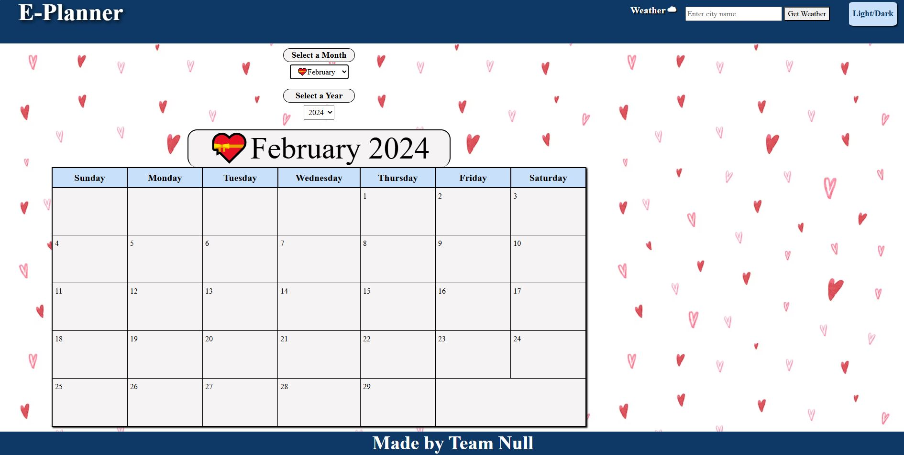
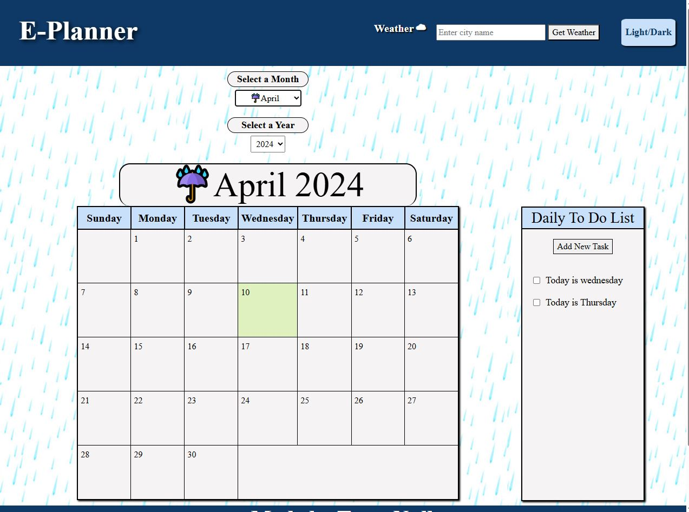
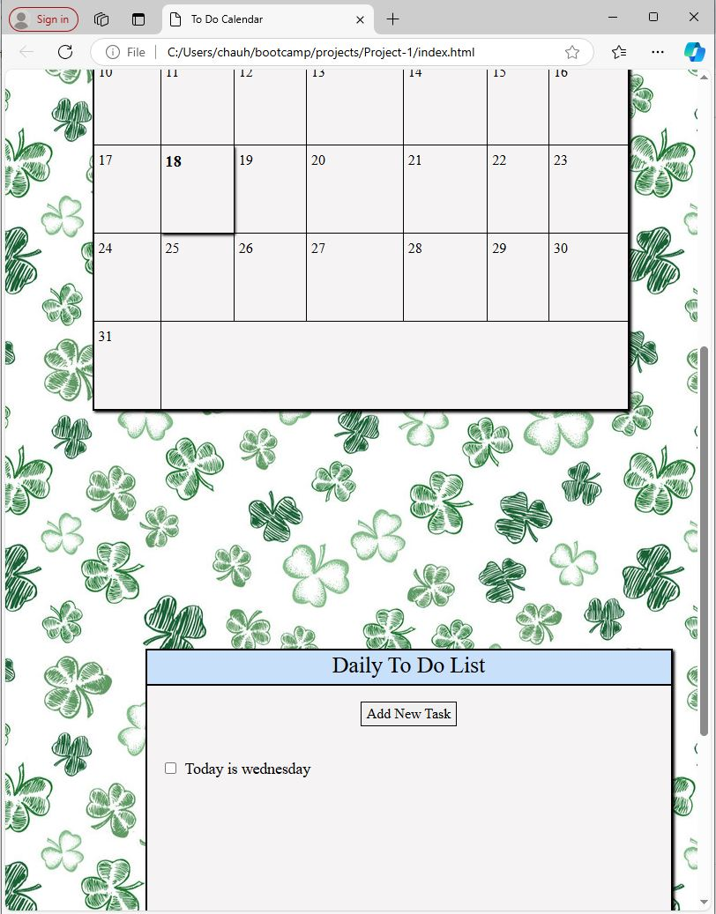

Professional ReadMe
# <E Planner>

## Description

Our team work togeher to develop the front end project website consist of a calendar, to do list and weather forcast station. Our team works together to brainstorm the idea through sketchboard and research. We work on the coding together through the VSO live sharing. 

## Installation

    Install the bootstrap CSS  and create a new repository. Then, we create new folder and files structures on our local computer. Our teammate upload the files to the Git Hub repository. Then every team member download the starter files. We also use the Visual studio live sharing for everyone to work on during meeting. When not in meeting, all of us do the research and develop ideas for the project. 

## Usage

Toggle the month, The Background pictures change 

Weather station - input city and give you the weather.

Built in planner

Dark-light mode button will toggle the background color.

Media Query:

## Credits

 * Hon chau 

Third-party tool:
Bootstrap CSS

## License

MIT License

## Features

If your project has a lot of features, list them here.
1. calendar 
2. To-do list function will let user to input task for each day. When the tasks are completed, the calenday day will change color to reflect the action. 
3. Weather station - input any US city and will output the corresponding city. 

## Tests

Go the extra mile and write tests for your application. Then provide examples on how to run them here.